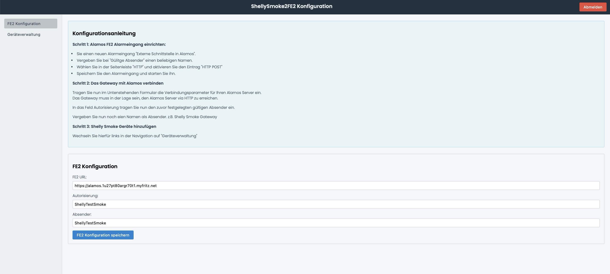
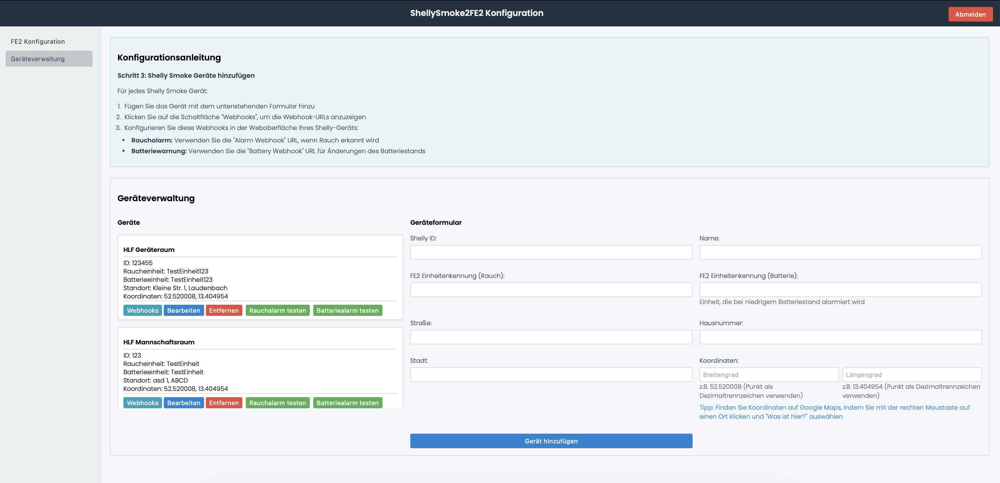
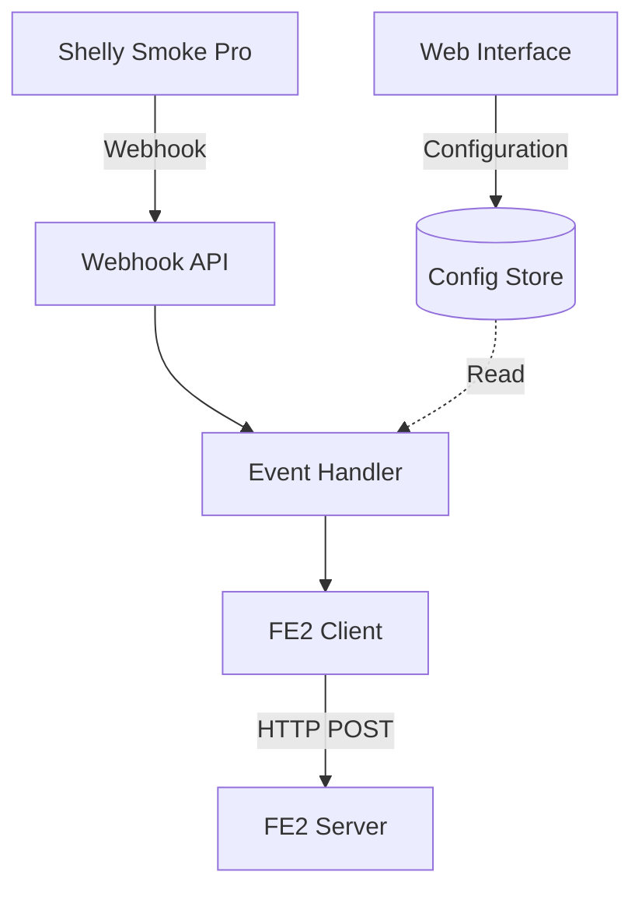

# Shelly Smoke Plus Alamos FE2 Gateway

Dieser kleine Gateway hilft euch dabei, den Shelly Smoke Plus mit einem Alamos FE2 Backend zu verbinden. 

Aktuell brennen viele Gerätehäuser freiwilliger Feuerwehren aus, weil sich ein Brand im Fahrzeug beim laden von Batterien entwickelt. 
Diese Gateway ermöglicht das Verbinden von Shelly Smoke Plus Rauchmeldern mit einem Alarmeingang von Alamos. 
So kann relativ günstig eine überganslösung bis zum Vorhandensein einer BMA im Gerätehaus realisiert werden.

Der Gateway befindet sich aktuell noch in der Entwicklung. Er sollte nur in internen Netzwerken betrieben werden und aktuell nicht für den Zugriff aus dem Internet gedacht. 

Eine Übersetzung der Readme wird es demächst auch noch geben.

## Haftungsausschluss: 
Der Gateway wird hier als Open Source Software unter Ausschluss jeglicher Haftung angeboten. Der Einsatz erfolgt auf wie immer auf eigene Gefahr. Für den zuverlässigen Betireb ist ebenfalls ein stabiles WLAN Netz erfroderlich. 

## Screenshots:






# Run the Service

# Docker Installation

## Mit Docker Compose ausführen

Der einfachste Weg, den Shelly-FE2-Gateway zu betreiben, ist über Docker Compose.

### Voraussetzungen

- Docker und Docker Compose müssen auf dem System installiert sein
- Ein stabiles Netzwerk mit Zugriff auf das FE2-System

### Docker Compose-Datei

Das Repository lokal clonen und dann die docker-compose entsprechend anpassen.:

```yaml
version: '3.8'

services:
  app:
    image: shellysmoke2fe2:latest
    build: .
    ports:
      - "3000:3000"
    volumes:
      - config:/config
    environment:
      - CONFIG_PATH=/config/config.json
      - ADMIN_USERNAME=admin
      - ADMIN_PASSWORD=admin
      - JWT_SECRET=ReplaceThisWithYourSecret

volumes:
  config:
```

### Starten des Services

1. Öffnen Sie ein Terminal im Verzeichnis mit der docker-compose.yml
2. Führen Sie folgenden Befehl aus:
     ```
     docker-compose up -d
     ```

### Verwaltung

- Logs anzeigen: `docker-compose logs -f`
- Service stoppen: `docker-compose down`
- Service neustarten: `docker-compose restart`

Nach dem Start ist die Weboberfläche unter http://localhost:3000 erreichbar.

## Configuring Shelly Smoke Pro Webhooks

1. Add your Shelly Smoke Pro device in the web interface
2. Click the "Webhooks" button for your device to reveal the webhook URLs
3. Log into your Shelly Smoke Pro web interface
4. Navigate to "Actions" in the menu
5. Configure two webhooks:

### Alarm Webhook
- Trigger: When smoke is detected
- URL: Copy the "Alarm Webhook" URL from the web interface
- Method: POST

### Battery Webhook
- Trigger: When battery level changes
- URL: Copy the "Battery Webhook" URL from the web interface
- Method: POST

Remember to click "Save" after configuring each webhook.

## Using the Web Interface

1. Configure FE2 Settings:
   - Enter your FE2 server URL (e.g., `http://fe2.local:83`)
   - Add your FE2 authorization token
   - Set the sender name that will appear in FE2

2. Add Shelly Smoke Devices:
   - Enter a unique device ID
   - Provide a descriptive name
   - Set the FE2 unit number for smoke alarms
   - Set the FE2 unit number for battery warnings
   - Enter the device location details
   - Click "Add Device"

3. Managing Devices:
   - Click "Webhooks" to see the webhook URLs for each device
   - Use "Copy" buttons to copy URLs to clipboard
   - "Edit" allows you to modify device settings
   - "Remove" deletes the device configuration

4. Configure Shelly Device Webhooks:

## Architecture

The application serves as a bridge between Shelly Smoke Pro devices and FE2 alarm systems. It consists of three main components:

1. Web Interface - For configuration and device management
2. Webhook API - Receives alerts from Shelly devices
3. FE2 Client - Forwards alerts to the FE2 system

### Communication Flow



### API Documentation

#### Webhook Endpoints

1. Alarm Webhook
```
POST /api/webhook/{deviceId}/alarm
```
Payload example:
```json
{
    "events": {
        "smoke": true
    }
}
```

2. Battery Webhook
```
POST /api/webhook/{deviceId}/battery
```
Payload example:
```json
{
    "battery": {
        "percent": 85
    }
}
```

#### Configuration API

1. Device Management
```
GET /api/devices
POST /api/devices
PUT /api/devices/{deviceId}
DELETE /api/devices/{deviceId}
```

2. Settings
```
GET /api/settings
PUT /api/settings
```

### FE2 Integration

The application communicates with FE2 using its HTTP interface. Alerts are sent as POST requests with the following format:

```
POST http://{fe2-server}/msgservice/msg
```
Payload:
```json
{
    "sender": "configured-sender-name",
    "unit": "configured-unit-number",
    "text": "Smoke detected at {location}"
}
```

### Error Handling

- Failed webhooks return HTTP 400 for invalid requests
- Configuration errors return HTTP 422 with error details
- FE2 communication failures are logged and retried
- Device configuration validation ensures proper setup

## Configuration

The `AuthService` uses environment variables to configure the admin credentials and JWT secret. You can set these variables in your environment or in a `.env` file at the root of your project.

### Environment Variables

- `ADMIN_USERNAME`: The username for the admin user (default: `admin`)
- `ADMIN_PASSWORD`: The password for the admin user (default: `password`)
- `JWT_SECRET`: The secret key used to sign the JWT tokens (default: `your_jwt_secret`)

### Example `.env` file

```
ADMIN_USERNAME=your_admin_username
ADMIN_PASSWORD=your_admin_password
JWT_SECRET=your_jwt_secret
```

Make sure to restart your application after changing these variables.


# Disclaimer:
Diese Software wurde mit der Hilfe von Github CoPilot erzeugt. Der Anwendungsfall war für mich ein kleines Beispiel um die Leistungsfähigkeit KI Gestützer Programmierung zu testen... 